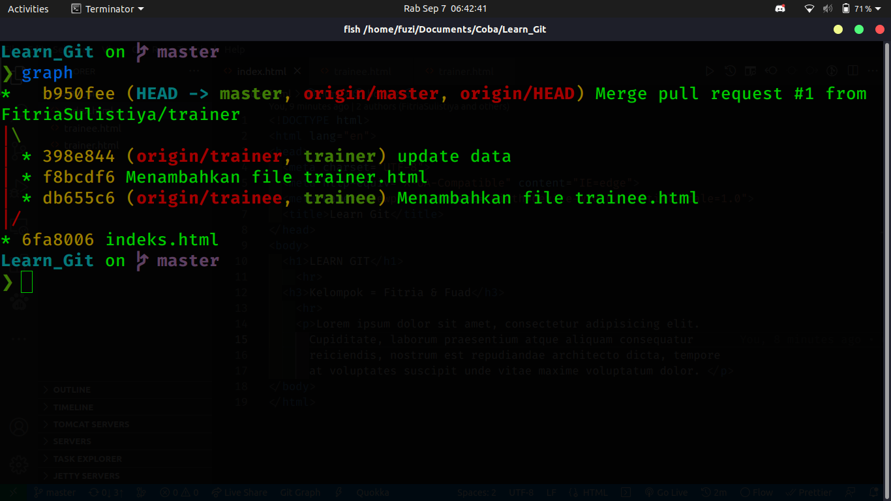

# **LEARN ABOUT GIT**

Hello...
Now, we learn about git and to connect it to our github.

## **Our Team:**

- [Fitria](https://github.com/FitriaSulistiya)
- [Fuad](https://github.com/fuad-zein)

### **Main Task:**

- Fast Forward 1
  

- Fast Forward 2
  

- Two Way Merge
  
